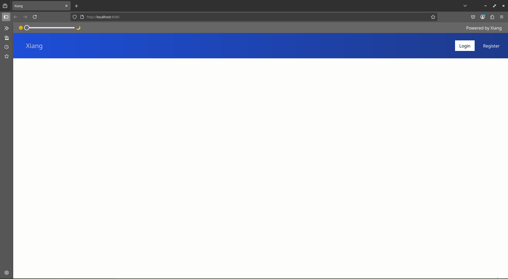
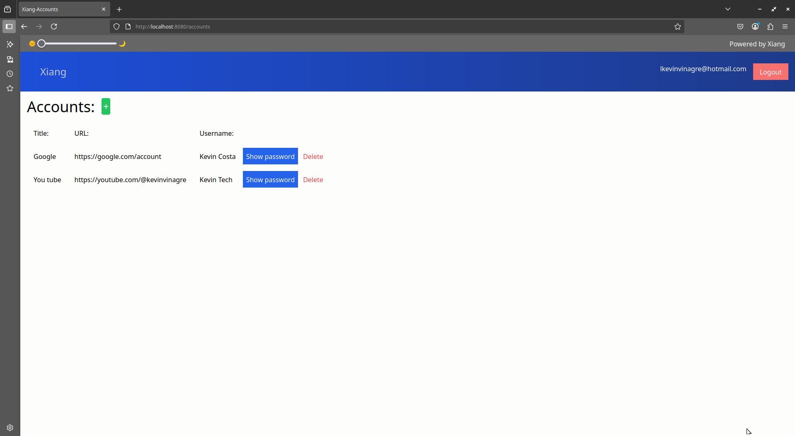
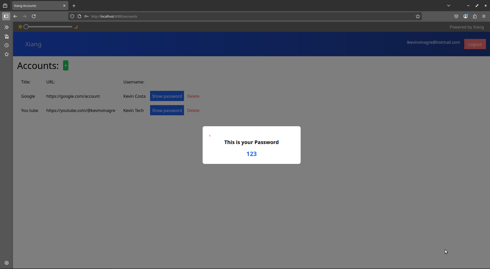
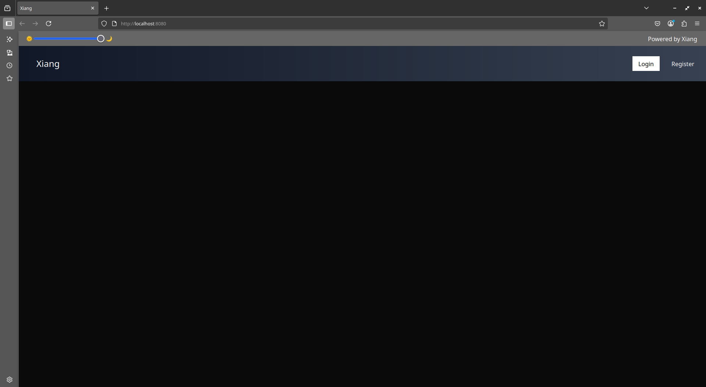
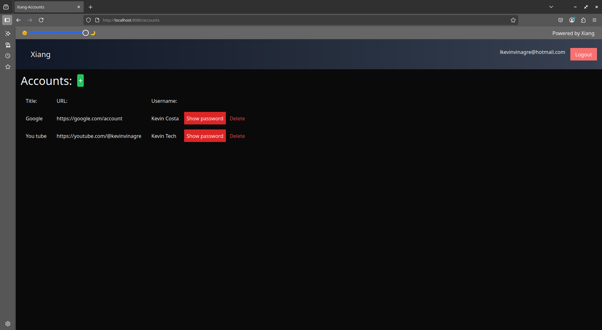
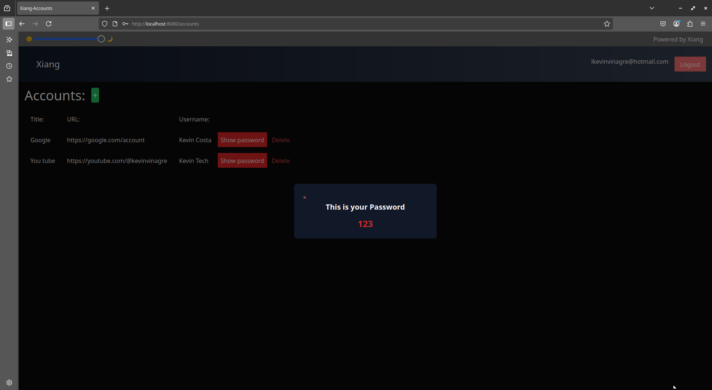

# 箱  xiãng

xiãng account is the way to protect your accounts

Projeto de armazenamento de senhas xiãng busca trazer uma forma de dar acesso a contas corporativas sem perder controle de tais acessos a ideia se da por usar logins automaticos por urls onde o funcionário so precisa clicar na conta e sao logados sem precisar ter acesso a senha.

Projeto de teste para Gree

# ⚙️Tecnologias 

  
  

> 
Laravel -> framework
 
> 
JWT-> geração de token

> 
Tailwind -> estilização css

> 
Alpine -> controle das blades

> 
docker -> virtualização de ambiente

# 🚀 Como rodar

## 🐳Ambiente Docker
Docker Engine e necessario para essa execução.
<li>Baixe o projeto da forma que desejar</li>
<li>Abra a pasta do projeto</li>
<li>Abra a pasta xiang-app</li>
<li>Rode o comando: 'npm install' para instalar as depedencias node</li>
<li>Então rode o comando 'npm run build' para gerar as estilizações</li>
<li>(opicional) Rode o comando 'composer install' para instalar as depedencias do composer</li>
<li>Rode o comando 'docker compose up -d --buid' e espere o docker fazer o ambiente virtual </li>

Caso haja algum problema na execução execulte o comando 'docker compose down' e execute novamente tal glich acontece pelo fato de que mesmo as migrates estando configuradas para rodar apos o banco ser criado a mesma esta demorando pra execultar o que faz que a mesma nao seja considerada na primeira execução executando uma segunda vez o volume ja estara com as migrates por isso e importante nao apagar o volume, colocando o comando 'docker compose down' e logo em seguida novamente 'docker-compose up -d --buiild' resolve tal situação.

# ⚠️ Atenção

Para rodar a aplicação nesse meio valide se as portas 8080, 3306, 8081:80 estão livres pois serão as portas que o docker usara para virtualização do ambientes as mesmas podem ser alteradas no docker-compose.yml 

## 👩🏻‍💻 Modo Host
Avalie se possui um banco de dados mysql rodando na porta 3306 php e composer devidamente configurados assim como o nodejs.
<li>Baixe o projeto da forma que desejar</li>
<li>Abra a pasta do projeto</li>
<li>Abra a pasta xiang-app</li>
<li>Rode o comando: 'npm install' para instalar as depedencias node</li>
<li>Então rode o comando 'npm run build' para gerar as estilizações</li>
<li>(opicional) Rode o comando 'composer install' para instalar as depedencias do composer</li>
<li>Execulte o comando de migrates rodando 'php artisan migrate'</li>
<li>Execulte o comando 'composer run dev' para execultar a aplicação no modo desenvolvedor</li>

# 🐞 Bugs:

Atualmente dois bugs marjoritarios são o de primeira compilação do docker que foi abordado na sessão do docker o mesmo se dar por conta das migrations que nao conseguem ser consideradas em primeira execução como explicado na mesma a segunda e os modals piscarem rapidamente na tela ao atualizar o mesmo se da por um bug no alpine mesmo com o x-clock continua ocorrendo e a terceeira e que ao adicionar uma conta e necessario atualizar a pasta isso se da pq ao adicionar o render da pagina ja foi realizado então se ve necessario criar um componente para atualizar a mesma apos uma edição tais bugs estão sendo testados para serem corrigidos

# ☀️ Light theme

# 🌙 Dark Theme

